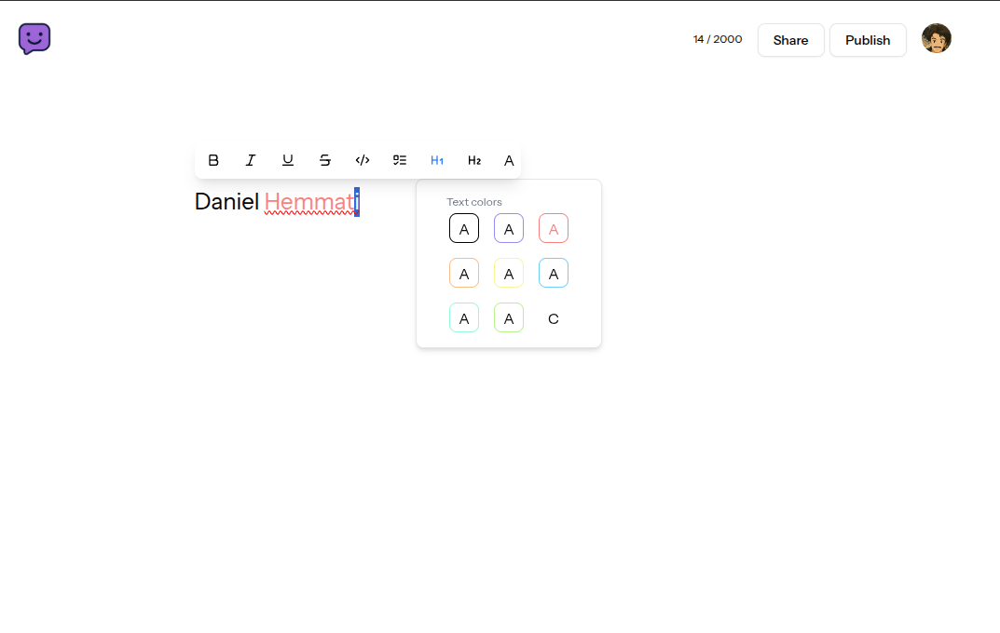

# smolaboutme.com 🌐

The goal of this project is to create a simple and easy to use tool for creating a simple about me page, with the notion like editor experience.  

## How does it work? 🛠️

The editor is powered by [tiptap](https://tiptap.dev/). Some of the tiptap extensions are free and some of them are paid.

All of the extensions which i used are free.

## Why did you made this? 🤔

Well I wanted to know how notion works and how it's built (the frontend part mostly).

## Features ✨

Currently this feature are implemented:

- [x] Floating menu
- [x] Simple drag and drop
- [x] Bold, italic, underline, strike, code, code block, ordered list, bullet list, ...

## How to run it? 🚀

Clone the repository, install the dependencies (make sure you have docker installed) and run it.
